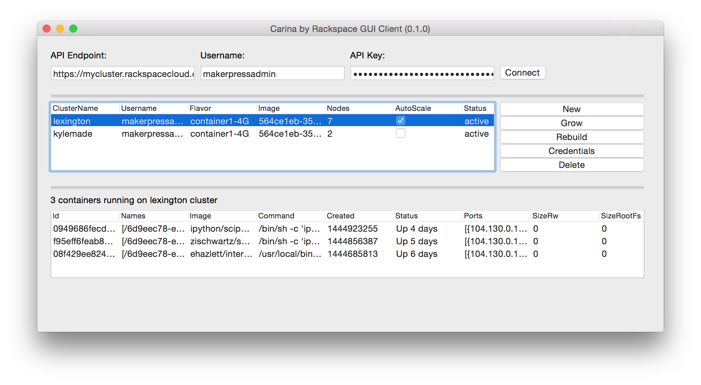

# Simple GUI for Carina by Rackspace

This project uses [libcarina](https://godoc.org/github.com/rackerlabs/libcarina) and [andlabs/ui](https://github.com/andlabs/ui) to create a simple GUI for managing clusters on Carina by Rackspace.  The GUI looks like this:



You can download the binary from the release page.

## Credentials

The GUI requires an API endpoint, your Rackspace username, and your API key (available in your user settings).  It will try to use the environment variables `CARINA_API_ENDPOINT`, `CARINA_USERNAME`, and `CARINA_APIKEY` to pre-populate these fields.

## Building (OSX)

See [andlabs/ui](https://github.com/andlabs/ui) for more specific requirements for your platform, but on OSX the main thing you need is XCODE and Go 1.5.  Once you have thos, do this:

```
GOOS=darwin go build -a -installsuffix cgo -o carina-gui-darwin-amd64 .
```

Use `chmod +x carina-gui-darwin-amd64` to make it executable.
